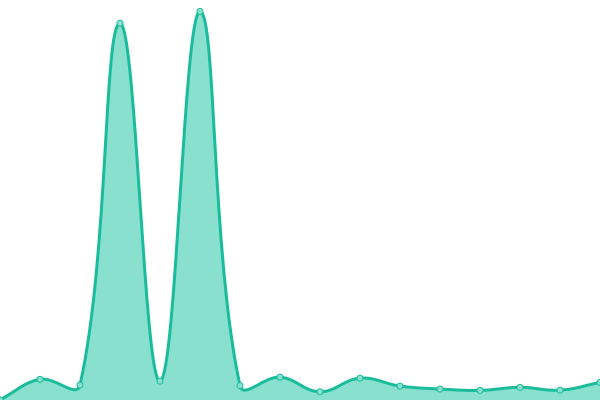
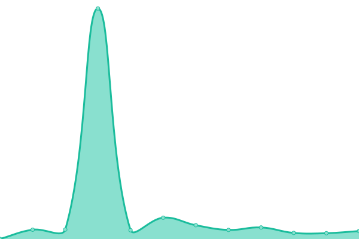
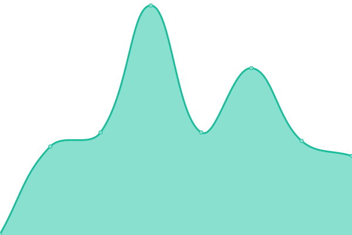
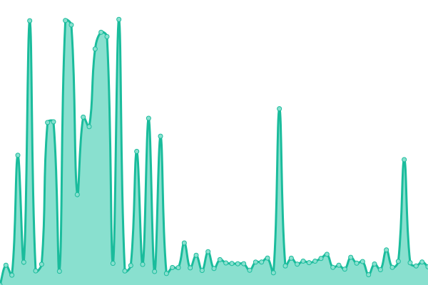

# [📈 Live Status](https://uptime.sk5s.cyou): <!--live status--> **🟩 All systems operational**

This repository contains the open-source uptime monitor and status page for [sk5s](https://www.sk5s.cyou/), powered by [Upptime](https://github.com/upptime/upptime).

With [Upptime](https://upptime.js.org), you can get your own unlimited and free uptime monitor and status page, powered entirely by a GitHub repository. We use [Issues](https://github.com/sk5s/uptime/issues) as incident reports, [Actions](https://github.com/sk5s/uptime/actions) as uptime monitors, and [Pages](https://uptime.sk5s.cyou) for the status page.

<!--start: status pages-->
<!-- This summary is generated by Upptime (https://github.com/upptime/upptime) -->
<!-- Do not edit this manually, your changes will be overwritten -->
<!-- prettier-ignore -->
| URL | Status | History | Response Time | Uptime |
| --- | ------ | ------- | ------------- | ------ |
|  [sk5s.com](https://sk5s.com) | 🟩 Up | [sk5s-com.yml](https://github.com/sk5s/uptime/commits/HEAD/history/sk5s-com.yml) | 

 178ms
     
 | 

<a href="https://uptime.sk5s.cyou/history/sk5s-com">100.00%</a>
    

|  [sk5s.cyou](https://sk5s.cyou/) | 🟩 Up | [sk5s-cyou.yml](https://github.com/sk5s/uptime/commits/HEAD/history/sk5s-cyou.yml) | 

 219ms
     
 | 

<a href="https://uptime.sk5s.cyou/history/sk5s-cyou">100.00%</a>
    

|  [sk5s-games](https://games.sk5s.com/) | 🟩 Up | [sk5s-games.yml](https://github.com/sk5s/uptime/commits/HEAD/history/sk5s-games.yml) | 

 163ms
     
 | 

<a href="https://uptime.sk5s.cyou/history/sk5s-games">100.00%</a>
    

|  [wowcode](https://wowcode.sk5s.com/) | 🟩 Up | [wowcode.yml](https://github.com/sk5s/uptime/commits/HEAD/history/wowcode.yml) | 

 144ms
     
 | 

<a href="https://uptime.sk5s.cyou/history/wowcode">100.00%</a>
    

|  [weread](https://weread.sk5s.cyou/) | 🟩 Up | [weread.yml](https://github.com/sk5s/uptime/commits/HEAD/history/weread.yml) | 

 341ms
     
 | 

<a href="https://uptime.sk5s.cyou/history/weread">100.00%</a>
    

|  [whereisspy](https://app.wis.sk5s.cyou/) | 🟩 Up | [whereisspy.yml](https://github.com/sk5s/uptime/commits/HEAD/history/whereisspy.yml) | 

 171ms
     
 | 

<a href="https://uptime.sk5s.cyou/history/whereisspy">100.00%</a>
    

|  [parking-go-website](https://parking-go.surge.sh/) | 🟩 Up | [parking-go-website.yml](https://github.com/sk5s/uptime/commits/HEAD/history/parking-go-website.yml) | 

 1203ms
     
 | 

<a href="https://uptime.sk5s.cyou/history/parking-go-website">100.00%</a>
    

|  [countdate-website](https://app.countdate.sk5s.cyou/) | 🟩 Up | [countdate-website.yml](https://github.com/sk5s/uptime/commits/HEAD/history/countdate-website.yml) | 

 202ms
     
 | 

<a href="https://uptime.sk5s.cyou/history/countdate-website">100.00%</a>
    

<!--end: status pages-->

[**Visit our status website →**](https://uptime.sk5s.cyou)

## 📄 License

- Powered by: [Upptime](https://github.com/upptime/upptime)
- Code: [MIT](./LICENSE) © [sk5s](https://www.sk5s.cyou/)
- Data in the `./history` directory: [Open Database License](https://opendatacommons.org/licenses/odbl/1-0/)
